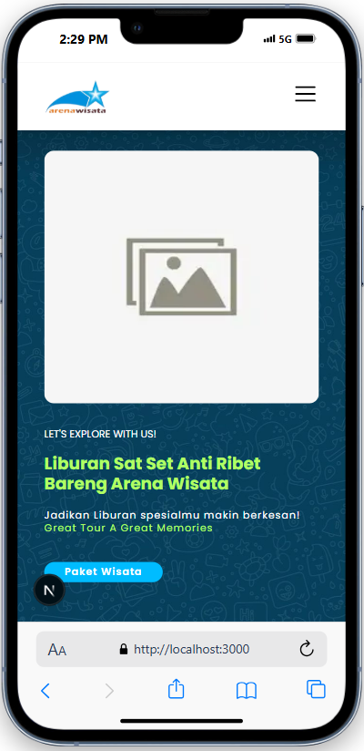

# Proyek Slicing UI - Arena Wisata (Next.js & Tailwind CSS)

Proyek ini adalah latihan *slicing* UI dari desain website [arenawisata.co.id](https://arenawisata.co.id) yang dibangun menggunakan Next.js dan Tailwind CSS. Tujuannya adalah untuk mempraktikkan dan memperdalam pemahaman tentang konsep pengembangan frontend modern.

## 📸 Tampilan Proyek



## ✨ Fitur Utama

  - **Desain Responsif**: Tampilan yang menyesuaikan diri dari mobile, tablet, hingga desktop.
  - **Komponen Reusable**: Dibangun dengan komponen-komponen yang bisa dipakai ulang seperti Button, Navbar, dan Card.
  - **Mobile-First Approach**: Didesain dengan mengutamakan tampilan mobile terlebih dahulu.

## 🚀 Teknologi yang Digunakan

  * [**Next.js**](https://nextjs.org/) - Framework React untuk produksi.
  * [**React**](https://react.dev/) - Library JavaScript untuk membangun antarmuka pengguna.
  * [**Tailwind CSS**](https://tailwindcss.com/) - Kerangka kerja CSS utility-first.
  * [**`next/font`**](https://www.google.com/search?q=%5Bhttps://nextjs.org/docs/app/building-your-application/optimizing/fonts%5D\(https://nextjs.org/docs/app/building-your-application/optimizing/fonts\)) - Untuk optimisasi font (Poppins).
  * [**Git & GitHub**](https://github.com/) - Untuk kontrol versi.

## 🛠️ Panduan Instalasi & Menjalankan Proyek

Berikut adalah langkah-langkah untuk menjalankan proyek ini di komputer lokal Anda.

**1. Clone Repositori**

```bash
git clone https://github.com/ilsetiawan1/02-sclicing-arenawisata-nextjs.git
```

**2. Masuk ke Direktori Proyek**

```bash
cd 02-sclicing-arenawisata-nextjs
```

**3. Install Dependensi**
Gunakan npm untuk menginstal semua *package* yang dibutuhkan.

```bash
npm install
```

**4. Jalankan Server Development**
Perintah ini akan menjalankan aplikasi di mode development.

```bash
npm run dev
```

**5. Buka di Browser**
Buka [http://localhost:3000](https://www.google.com/search?q=http://localhost:3000) di browser Anda untuk melihat hasilnya.

## 📂 Struktur Folder

  * `src/app/`: Berisi semua halaman dan rute utama aplikasi.
  * `src/components/`: Berisi semua komponen UI yang *reusable*.
  * `public/`: Berisi semua aset statis seperti gambar dan ikon.
  * `tailwind.config.js`: File konfigurasi untuk Tailwind CSS.
